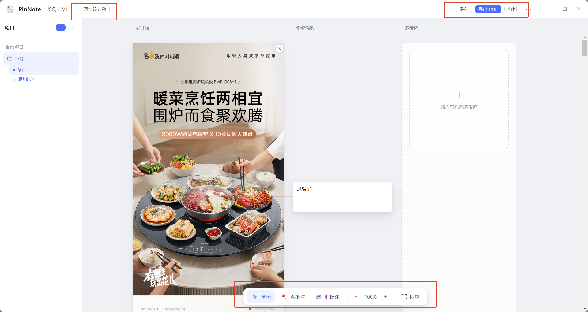

# PinNote


直接在详情页、UI 稿和截图上打点、框选、写修改意见、附参考图，
再导出为一份清楚、可执行的 PDF 修改单。

无需登录 · 无需上传 · 数据保存在本机

**English**

Turn visual feedback into clear, actionable revisions.

A lightweight tool for reviewing designs, attaching references,
and exporting structured PDF feedback.

**⬇️ [下载最新版 Download](https://github.com/ColinChen404/pinnote/releases/latest)** · Windows 10 / 11



**[简体中文](#简体中文)** | **[English](#english)** | **[更新日志 Changelog](CHANGELOG.md)**

---

## 简体中文

### 为什么做 PinNote

PinNote 最初要解决的问题特别小：怎么给一张电商详情页提修改意见。

我们过去的做法，堪称石器时代的遗产——先把详情页截成图，一张张塞进 Excel，再在旁边开一列写反馈（肯定有能解决这个问题的工具，但我也确实一直没找到趁手的）。

倒也不是不能用，毕竟我这么用了四年。问题在于："怎么改"通常一句话就能说清，真正折磨人的是先得说明"要改的地方在哪"。

"第二屏偏下那张产品图的右边。"  
"不是主标题，是主标题下面那行小字。"  
"再往下一点——对，就是那里。"

一条十几个字的意见，前面要垫上一大段寻址说明。写的人累，找的人更累。设计稿一改版，截图、排版、坐标，全部重来一遍。

为什么不能直接在原图上点一下？

点出位置，框出范围，旁边写清楚怎么改；文字说不明白，就再贴一张参考图。所有意见自动汇总成一份修改单，直接发给设计、开发或供应商。

不就完了吗。

可惜我不会编程。

——感谢这个可以 vibe coding 的时代。

### 核心能力

- **点哪儿，钉哪儿**：点批注、框批注直接落在设计稿原图上，问题位置一眼可见，不用再用文字描述"在哪"
- **标注即建议**：每条标注自动连线一张修改说明卡，位置和意见一一对应，不会张冠李戴
- **参考图对照**：文字说不清"改成什么样"，就贴一张参考图，挂在意见旁边
- **一键修改单**：所有意见汇总成一份长页 PDF——带原图、标注、说明、参考图，直接发给设计、开发或供应商
- **多稿迭代**：项目 / 版本两级管理（V1、V2…），新稿开新画布，历史随时回看
- **顺手细节**：Ctrl+V 粘贴截图、多张长图无缝拼接、0.6s 自动保存、无需登录不上传

### 快捷键

| 快捷键 | 功能 |
| --- | --- |
| Q | 鼠标（选择 / 拖动） |
| W | 点批注 |
| E | 框批注 |
| Ctrl+V | 粘贴图片 |
| Ctrl+S | 保存 |
| Delete | 删除选中标注 |
| Esc | 关闭弹窗 / 退出工具 |
| Ctrl+滚轮 / + / − / 0 | 缩放 / 重置缩放 |

### 数据与隐私

- 项目数据（设计稿、标注、建议、参考图）保存在 `%APPDATA%\PinNote\store\`
- 导入的图片会复制进项目目录，删除原图不影响已有项目
- 卸载软件不会自动删除项目数据

### 开发

```bash
npm install      # 安装依赖（包含 Electron 运行时）
npm start        # 启动应用（开发态）
npm run smoke    # 运行 45 项自动化冒烟测试
npm run build    # 打包 Windows 安装包到 dist/
```

技术栈：**Electron + 原生 JavaScript + 本地 JSON 存储**，无前端框架、无构建步骤。
技术细节与开发约定见 [交接说明](交接说明-面向新开发Agent.md)。

### 字体说明

应用内置 [Noto Sans SC](https://fonts.google.com/noto/specimen/Noto+Sans+SC)（思源黑体同源设计），依 [SIL Open Font License](build-res/fonts/LICENSE-NotoSansSC-OFL.txt) 随应用分发。

### 设计理念

PinNote 不追求成为复杂的在线协作或审批平台，只专注解决一个问题：

> 让设计反馈落在具体位置上，变成清楚、可执行的修改意见。

一个人用 PinNote 整理反馈，其他人通过 PDF 接收和执行。
无需登录，无需上传，项目数据保存在本机。

---

## English

### Why PinNote

PinNote started from a remarkably small problem: how do you give revision feedback on an e-commerce product page?

Our old workflow was a relic from the stone age — screenshot the page, paste the images into Excel one by one, and write feedback in a column beside them. (Surely tools exist for this. I just never found one that felt right.)

It sort of works — I did it for four years. The thing is, *"what to change"* usually takes one sentence. What's truly maddening is having to explain *"where the change goes"* first.

"Bottom of screen two, the product image, on the right."  
"Not the headline — the small line under it."  
"A bit lower. Yes, there."

A ten-word comment ends up wearing a paragraph of directions. Exhausting to write, more exhausting to hunt down — and when the draft gets revised, the screenshots, the layout, every coordinate: start over.

Why not just click on the image?

Mark the spot, box the range, write the fix beside it; when words aren't enough, attach a reference image. Every comment rolls up into a single revision sheet, ready to send to design, development, or a supplier.

And that would be that.

Unfortunately, I couldn't code.

—— Thank goodness for an age where you can vibe code.

### Features

- **Pin it where it is**: pin and box annotations land right on the design — no more describing "where" in words
- **Annotation is the comment**: every mark auto-connects to its own note card, so position and fix always stay paired
- **Reference images**: when words can't say "make it look like this", attach one right beside the note
- **One-click revision sheet**: everything rolls up into a single long-page PDF — original, annotations, notes, references — ready to send
- **Iterate by version**: projects and versions (V1, V2…); a new draft means a fresh canvas, and history stays browsable
- **Quality-of-life**: paste with Ctrl+V, stitch long screenshots, 0.6s autosave, no login and no uploads

### Shortcuts

| Key | Action |
| --- | --- |
| Q | Mouse (select / drag) |
| W | Pin annotation |
| E | Box annotation |
| Ctrl+V | Paste image |
| Ctrl+S | Save |
| Delete | Delete selected annotation |
| Esc | Close dialog / exit tool |
| Ctrl+Wheel / + / − / 0 | Zoom / reset zoom |

### Data & Privacy

- Projects live in `%APPDATA%\PinNote\store\`
- Imported images are copied into the project; deleting originals is safe
- Uninstalling never deletes your project data

### Development

```bash
npm install      # install dependencies (Electron runtime included)
npm start        # run the app in dev mode
npm run smoke    # run 45 automated smoke assertions
npm run build    # build the Windows installer into dist/
```

Stack: **Electron + vanilla JavaScript + local JSON storage** — no frontend framework, no build step. See the [development notes](交接说明-面向新开发Agent.md) (Chinese).

### Typeface

The app bundles [Noto Sans SC](https://fonts.google.com/noto/specimen/Noto+Sans+SC) (the same design as Source Han Sans), distributed under the [SIL Open Font License](build-res/fonts/LICENSE-NotoSansSC-OFL.txt).

### Philosophy

PinNote has no ambition to become a complex online collaboration or approval platform. It focuses on one thing:

> Put design feedback exactly where it belongs — as clear, actionable revision notes.

One person organizes feedback in PinNote; everyone else receives and executes it via PDF.
No login, no uploads — project data stays on your machine.

---

## License / 许可

[MIT](LICENSE) © Colin Chen · Typeface 字体: [Noto Sans SC](build-res/fonts/LICENSE-NotoSansSC-OFL.txt) (SIL OFL)
